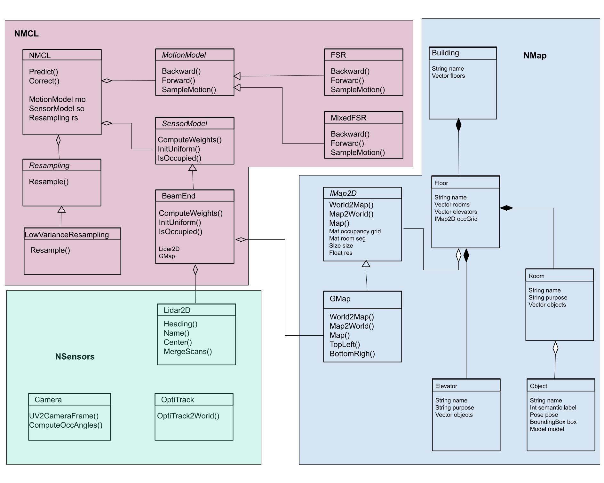

# Software Architecture

There are a few main concepts that drove the development of the system.

### Core-ROS Separation
The core C++ library that runs the NMCL algorithm does not include ROS code. That was done because it's good practice, and because I knew we would develop for ROS1 initially and then transition to ROS2 when the code is more mature.

### Modularity 
The [NMCL](nmcl/include/NMCL.h) class can be seen as an engine driving the MCL-type algorithm. The [motion model](nmcl/include/MotionModel.h) and [sensor model](nmcl/include/SensorModel.h) are abstracted through an interface, allowing the developer to change these models easily, without adjusting the localization engine. This enables quick evaluation of different models, isolating their impact. 

### Data Source Abstraction
A certain interface was defined for localization engine, and preprocessing is done depending on the source of the data. On the highest level, the functions and the order in which they are called remain the same whether the data is read from a binary/text files or received through ROS topics. On a lower level, the localization engine only knows it is receiving a scan in a form of heading angles and ranges. The developer may painlessly adjust the algorithm to receive scans from one or more range-finding devices. 
Example for a standard localization process:
* Initialize the NMCL class with the motion and sensor models
* Predict method with an input that is appropriate for your motion model
* Correct method with an input that is appropriate for your sensor model. This step also includes that sampling strategy - I might change the sampling to be a class you can pass to the engine
* Stats method will return the prediction with covariance

## Design Intro
In our ROS wrappers, we imlemented two motion models, for odometry sources:
* [FSR](nmcl/include/FSR.h) - one odometry source
* [MixedFSR](nmcl/include/MixedFSR.h) - two odometry sources that we consider in equal probability 
They both target omnidirectional platforms.  

Our sensor model, [BeamEnd](nmcl/include/BeamEnd.h), requires that the range scans are converted to 3D points, in the coordinate frame of the base link. In our ROS wrapper, we combine scans from the front and rear lidars to a "virtual scan", centring both scans around the base link which is set to be the origin (0, 0, 0). This preprocessing step can be adjusted to suit the needs, e.g. processing only one lidar scan (or more than 2). The sensor (and motion) model can also be replaced in its entirety, provided that it complies with the interface. 

## UML

