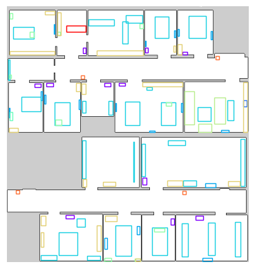
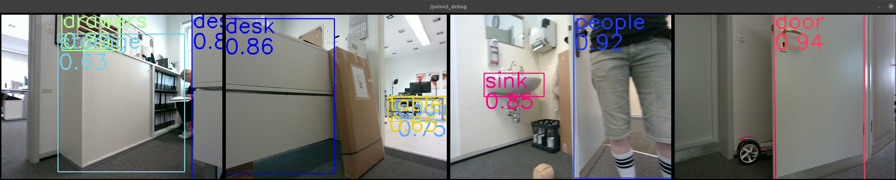

# Long-Term Localization using Semantic Cues in Floor Plan Maps
This repository contains the implementation of the following publication:
```bibtex
@article{zimmerman2022iros,
  author = {Zimmerman, Nicky and and Guadagnino, Tiziano and Chen, Xieyuanli and Behley, Jens and Stachniss, Cyrill},
  title = {{Long-Term Localization using Semantic Cues in Floor Plan Maps}},
  journal = arxiv,
  year = {2022}
}
```

## Overview
We provide a long-term localization solution and a semantic map format, for environments that undergo changes to their interior structure and detailed geometric maps are not available.

A deminstration of our semantic-guided localization in a previously unseen environment 
[](https://www.youtube.com/watch?v=ikmiHHIv70s "HSMCL")

### Abstract Semantic Maps
We enrich the sparse floor plans with geometric, semantic and textual information. 



### Object Detection 
We use [YOLOv5](https://github.com/ultralytics/yolov5) for object detection, but in theory it can be replaced by any other model that provides our algorithm with class prediction, bounding boxes and a confidence score. 


### Room Category Classification
We consider heirarchical semantic information, by building a higher level of semantic understanding based on the object detection results. We train a KNN classifier to infer the room category based on the objects detected in the scene. The format for the classification.pickle is a dataframe with 'samples' column which stores a one-hot-encoded vector corresponding to the semantic classes of the detected objects, and a 'predictions' column with an index corresponding to the correct room category.


## Installation
Requirements:
* ROS 1 - Noetic
* OpenCV 4.5 
* Eigen
* GTest
* [JSON parser](https://github.com/nlohmann/json)
* Packages - map_server, amcl, gmapping
* [YOLOv5](https://github.com/ultralytics/yolov5) - commit hash 7a2a118

To save you some pain, please follow to OpenCV installation instructions in this [link](https://docs.opencv.org/4.x/d7/d9f/tutorial_linux_install.html).

Required installations
```bash
sudo apt-get install nlohmann-json3-dev
sudo apt-get install libgtest-dev
sudo apt install libeigen3-dev
sudo apt-get install ros-noetic-gmapping
sudo apt-get install ros-noetic-amcl
sudo apt-get install ros-noetic-map-server
sudo apt-get install git-lfs
```

First you need to build the ncore library since I don't have a global CMake yet. Tough life. <br/>
```bash
git clone https://gitlab.ipb.uni-bonn.de/nicky.zimmerman/OmniNMCL.git
git lfs pull
cd OmniNMCL/ncore
mkdir build && cd build
cmake .. -DBUILD_TESTING=1 
make -j12
```
To see everything is built correctly, run the tests from the build directory
```bash
./bin/NMCLUnitTests
```
To integrate OpenCV 4.5 to ROS, you must download [vision_opencv](https://github.com/ros-perception/vision_opencv) to the ros1_ws/src folder, and then build the workspace
```bash
cd ros1_ws/src
git clone https://github.com/ros-perception/vision_opencv.git
cd vision_opencv
git checkout noetic
cd ../..
catkin_make
source devel/setup.bash
```
If you encounter errors related to OpenCV versions, you can check [this](Docs/vision_opencv Issues.md).

## Semantic Map Editor
You can our GUI app [MAPhisto](https://github.com/FullMetalNicky/Maphisto) for editing semantic maps. 
MAPhisto allows the user to add geometric, semantic and textual information to a floor map. 
MAPhisto requires 3 inputs:
* occupancy grid map (map_server format)
* room segmentation 
* floor.config
For detailed gmapping-style occupancy grid, the room segmentation must be manually annotated. For axis-aligned floor plans, you can extract it with the CreateMapAssests.py script. Using the script will als create a floor.config file.

## Running the Algo

We use ROS wrappers to run the NMCL algorithm. 

### ConfigNMCLNode
Requires as input 3 topics, LaserScan from the front lidar, LaserScan from the rear lidar, Odometry from VO or Odometry from the wheel encoders. The topic names are configurable through the launch file. This runs the correct and predict steps asynchronously, so correct is executed whenever we have odometry and predict is executed when an observation arrives. ConfigNMCLNodE publishes PoseWithCovarianceStamped messages with the pose prediction. To see the predictions in RVIZ, run
```bash
roslaunch nmcl_ros confignmcl.launch dataFolder:="path/to/data/folder/"
```

The data folder should have the following items:
* nmcl.config - defines algorithm parameters, like sampling stratgy, motion/observation model, particle number, etc.  
* floor.config - defines where the map resources are and semantic/textual information about the map
* <your-room-segmentation>.png/pgm/jpg 
* <your-occupancy-grid-metadata>.yaml (map_server format)
* <your-occupancy-grid>.png/pgm/jpg  (map_server format)

<br/>
If you don't stick to this structure and naming, nothing will work. I didn't feel like putting to much effort on parsing and stuff. For an example of the content of these files, you can check out [this](nmcl/tst/data/floor/JMap). The data folder contains mostly things that are environment specific, like maps and algorithms definitions.
<br/>

In addition, there is a configuration folder for sensors configuration. This includes:

* front_laser.config
* rear_laser.config
* cam0.config 
* cam1.config
* ...

The folder in which they are stored in also configurable through the launch files, but their names are hardcoded for now. An example of the format of the calibration file can be found in [here](nmcl/tst/data/config/front_laser.config).

ConfigNMCLNodE can also use cues from the text spotting and object recognition nodes, which you can also enable through the launch file.

### TextRecoNode

Listens to Image topics and publishes to a TextArray topic. 
Parameters:
* textSpottingConfig - the name of the textspotting.config file
* camIDs - I usually use my side-looking cameras (1, 3)
* cameraImgTopics - topic names for cameras with corrsponding IDs
Camera IDs should match the cam*.config file. In the textspotting.config, make sure to give the correct path to where the text spotting models and alphabet files are located.

### YoloV5Node
Listens to Image topics and broadcast to a YoloCombinedArray topic. In my implementation, I sync 4 cameras, get the prediction for all 4 images, and publishes it as a combined message. YoloV5Node.py has a hard-coded path pointing to where ever the YOLOv5 repository has been cloned to. So make sure to adapt it accordingly.
Parameters: 
* camIDs - I usually use all cameras (0,1,2,3) for 360 coverage
* cameraImgTopics - topic names for cameras with corrsponding IDs
* yoloTopic - where to publish the YOLO predictions
* weights - location of the model (.pt)
* conf_thres
* imgsize - set as max(image.height, image.width) for the camera streams
* dataset - the path for the dataset.yaml required for YOLO
The YOLOv5 node can be replaced by a user-chosen object detetion/semantic segmentation pipeline, as long as the outputs conform to the format of the YoloCombinedArray message.

### RoomClassifierNode
Listens to YoloCombinedArray topic and publishes to a Float32MultiArray topic. Based on the objects detected by YOLO, the room classifier predict which room category is more likely. 
Parameters: 
* yoloTopic - where to listen to the YOLO predictions
* roomTopic - where to publish room category predictions
* picklePath - The path to the training data pickle for the KNN classifier 

### SemanticMapNode
A visualizer for our abstract semantic maps. 
Parameters: 
* dataset - the path for the dataset.yaml required for YOLO
* dataFolder - as explained previous
* mapName 
* markerTopic - where to publish the semantic information


